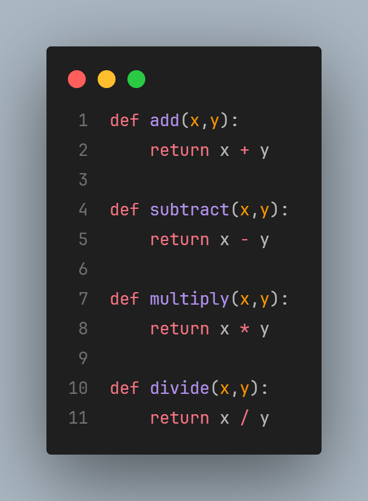
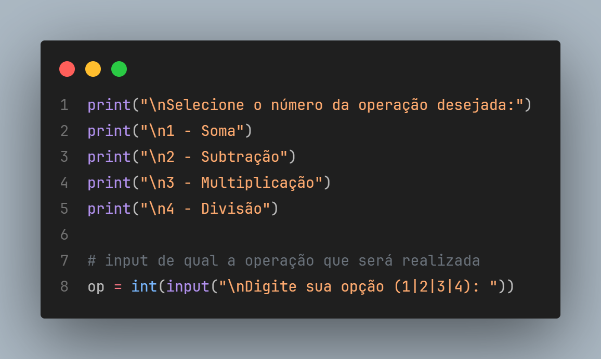
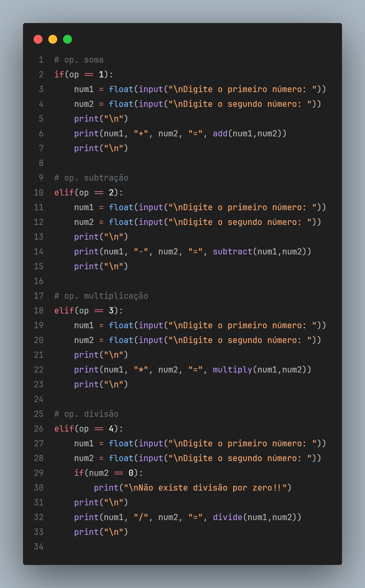
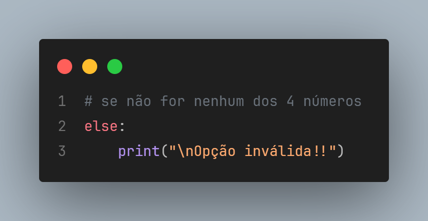

# Calculator 🛠️

This calculator is a project that I've made when I was attending a course in Data Science Academy to put together some basic knowledges in Python.

## 📌 Defining the math functions
First step of this development was to define the basic math functions that would be used.

## 📌 Selecting the function
At this step, it was defined a number to each one of the functions, making available to the user select which one he wants.

## 📌 Checking the user selection
Here, the program will check if the option selected by the user is available. If yes, it will split to the function that the user selected.

If the user's option isn't available, it will stop the program, making the user to select a right option.

Let me know if anything can be modified in order to make this app better.

# Enjoy!! 😎